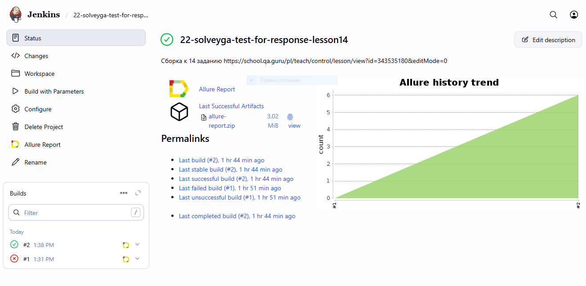
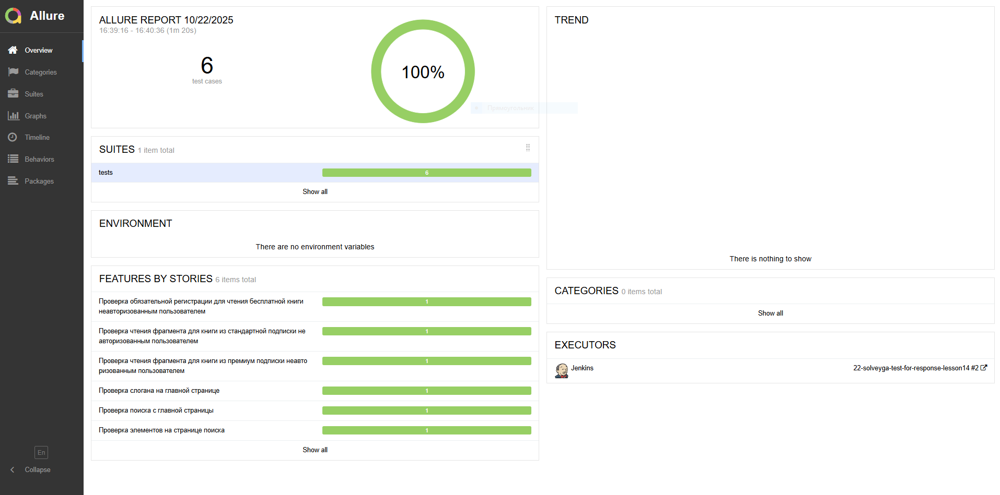
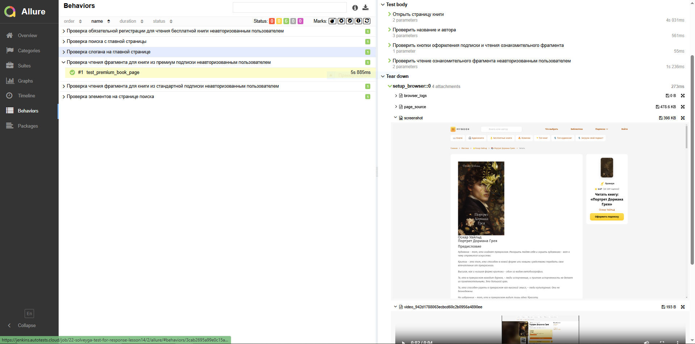
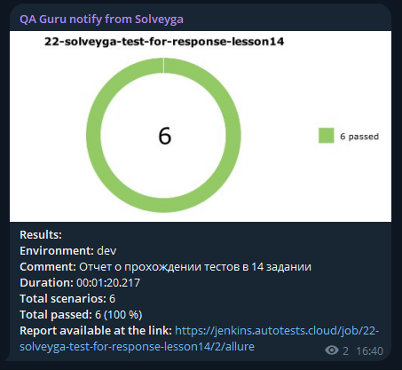

# Тестирование сайта mybook
[https://mybook.ru/](https://mybook.ru/)

### Настройка окружения
Перед запуском тестов необходимо создать файл `.env` в корне проекта:

1. Скопируйте файл `.env.example`: `cp .env.example .env`
2. Заполните файл `.env` актуальными значениями для доступа к Selenoid. Пример:
```commandline
SELENOID_LOGIN=user1
SELENOID_PASS=1234
SELENOID_URL=selenoid.autotests.cloud
```

### Команды запуска тестов:
Запуск всех тестов:
```
pytest tests
```
Запуск тестового файла:
```commandline
pytest tests/<test_file_name>
```
Запуск конкретного теста:
```commandline
pytest tests/<test_file_name>::<test_function_name>
```
Построение отчета после выполнения тестов:
```
allure serve allure-results
```

### Примеры отчета

Удаленный запуск в Jenkins:



Общая страница отчета в Allure:



Станица теста с логами браузера, скриншотом при завершении теста и видео прохождения теста:



Видео теста из отчета:


Отчет в телеграм через бота:



